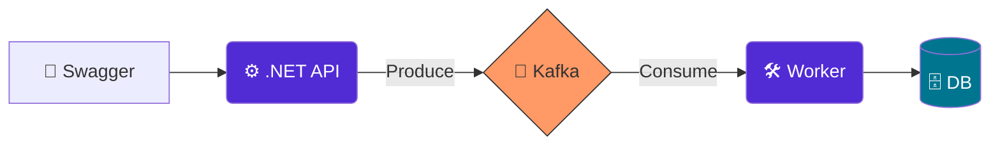

# 📦 Intelligent Logistics Gateway

## 🧠 Case Study: Arquitetura e Decisões

### 📍 Situation (Situação)
Em sistemas logísticos de alta demanda, o processamento direto no banco de dados durante o recebimento de pedidos pode causar lentidão (gargalos) e perda de dados em caso de instabilidade do servidor de persistência.

### 🎯 Task (Tarefa)
Desenvolver um gateway capaz de receber milhares de pedidos simultâneos, garantindo que a API permaneça disponível (low latency) e que nenhum pedido seja perdido, mesmo que o banco de dados esteja offline temporariamente.

### 🛠️ Action (Ação)
Implementei uma **Arquitetura Orientada a Eventos (EDA)** utilizando **.NET 8** e **Apache Kafka**. 
- Desenvolvi uma **Web API (Producer)** para recepção rápida de dados.
- Configurei um **Broker Kafka** via Docker para atuar como buffer de mensagens.
- Construí um **Worker Service (Consumer)** para processar e persistir os dados de forma assíncrona usando **Entity Framework Core**.

### 📊 Result (Resultado)
- **Desacoplamento Total:** A API responde em milissegundos, independentemente da carga no banco de dados.
- **Resiliência:** Se o Worker for interrompido, as mensagens permanecem seguras no Kafka e são processadas automaticamente assim que o serviço retorna (Backpressure handling).
- **Escalabilidade:** O sistema está pronto para escalabilidade horizontal, permitindo múltiplos consumidores para o mesmo tópico.

### 🏗️ Engineering (Engenharia)
- **Record Types:** Uso de imutabilidade para integridade dos dados.
- **Dependency Injection:** Código desacoplado facilitando testes unitários.
- **Containerização:** Ambiente 100% reproduzível via Docker Compose.

### 🏗️ Arquitetura do Sistema

  
<b>🛠️ Clique para ver Decisões de Engenharia e Stack</b>

  
  - **.NET 8:** Performance e tipagem forte.
  - **Kafka:** Resiliência e desacoplamento.
  - **SQLite:** Persistência leve e portátil.
  - **Clean Arch:** Separação entre Domínio e Infra.

